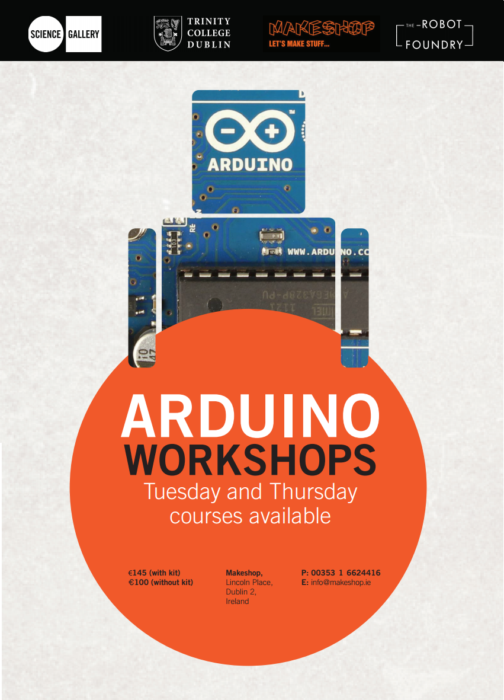

#www.theRobotFoundry.net
  
If you're interested in attending one of our courses just send us an email:
therobotfoundry@gmail.com  

###Sketches
Here's a collection of some of the sketches that we've worked on so far. This list will grow as the weeks progress.

- [Blink](#blink)  
- [Traffic Lights](#traffic-lights)  

### <a name="blink"></a> Blink
This is, traditionally, the very first sketch that people write. All it does is turn the light (LED) on and off. Every Arduino sketch must have a `setup()` block and a `loop()` block. In the setup block all the pins you want to use in your circuit are setup, or initialised, to be either **INPUT** or **OUTPUT** pins. This is done using the `pinMode()` function. Please note that Arduino programming is case sensitive, so INPUT, Input, and input are all different things. To turn the LED on or off the `digitalWrite()` function is used. It takes two pieces of information, also known as parameters or arguments for the function. It needs to know what pin to work with and whether to turn it on or off.Finally,  the `delay()` function determines how long to wait before executing the next line of code & time is measured in miliseconds.
```C
void setup() {                
  // initialise pin 13 as an output.
  pinMode(13, OUTPUT);     
}

void loop() {
  digitalWrite(13, HIGH);   // set the LED on
  delay(1000);              // wait for a second
  digitalWrite(13, LOW);    // set the LED off
  delay(1000);              // wait for a second
}
```

This is a very simple MWE (minimum working example) which allows us to check that our code will compile and succesfully upload to our Arduino. However, it's not very robust and doesn't cope particulaly well with changes to the circuit. The SMS code below works better.

```C
/*
In this code we name the output pin "LED" and give it a value of pin 9.  
Our code now references a general pin name rather then a specific pin number.  
This means that if we need to change from pin 9 to any other pin we only have  
to make one change, and we can do this without the risk of breaking the rest  of our code.
*/

int LED = 9;            
int shortDelay = 200;
int longDelay = 500;

void setup(){
  pinMode(13, OUTPUT);
}

void loop(){

//morse code for letter "S"
 digitalWrite(LED, HIGH);
    delay(shortDelay);
 digitalWrite(LED, LOW);
    delay(shortDelay);
 digitalWrite(LED, HIGH);
    delay(shortDelay);
 digitalWrite(LED, LOW);
    delay(shortDelay);
 digitalWrite(LED, HIGH);
    delay(shortDelay);
 digitalWrite(LED, LOW);
    delay(shortDelay);

//morse code for letter "M"
 digitalWrite(LED, HIGH);
    delay(longDelay);
 digitalWrite(LED, LOW);
    delay(longDelay);
 digitalWrite(LED, HIGH);
    delay(longDelay);
 digitalWrite(LED, LOW);
    delay(longDelay);

//Morse code for "S"
 digitalWrite(LED, HIGH);
    delay(shortDelay);
 digitalWrite(LED, LOW);
    delay(shortDelay);
 digitalWrite(LED, HIGH);
    delay(shortDelay);
 digitalWrite(LED, LOW);
    delay(shortDelay);
 digitalWrite(LED, HIGH);
    delay(shortDelay);
 digitalWrite(LED, LOW);
    delay(shortDelay);

//Pause before going back to the begining of the loop
    delay(longDelay);
}

```
### <a name="traffic-lights"></a> Traffic Lights

###Thanks!
This page is made possible thanks to [Github Pages](https://pages.github.com) :octocat: